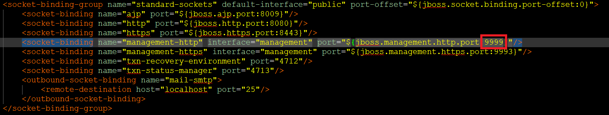

Das Backend wird in JavaEE entwickelt.

JavaEE braucht einen JavaEE zertifizieren Container in dem es ausgeführt wird, in unseren Fall ist das der Application Server Wildfly.

JavaEE bietet eine Abstraktion zwischen der eigentlichen Datenbank und dem Code der geschrieben werden muss. Dafür muss der Wildfly anschließend konfiguriert werden. Wir verwenden die freie postgres Datenbank als darunter liegende Datenbank.

Folgende Schritte müssen als Vorbereitung getroffen werden, bevor ein erstes Projekt entwickelt werden kann.

#### 1. Herunterladen der benötigen Komponenten

[Wildfly](https://wildfly.org/downloads/) (Zum Zeitpunkt der Erstellung dieser Readme 19.0.0.Final JavaEE Full & Web Distribution)

[Postgres](https://www.enterprisedb.com/downloads/postgres-postgresql-downloads) 12.2

[Postgres Driver für Wildfly](https://jdbc.postgresql.org/download/postgresql-42.2.12.jar)

[pgAdmin zur Verwaltung von Postgres](https://www.pgadmin.org/download/pgadmin-4-windows/)

#### 2. Installieren

Wildfly kann einfach in ein Verzeichnis kopiert werden.

Postgres dem Installationswizard folgen, dabei ist es wichtig sich den Port zu merken (Standard ist 5432) und den vergebenen Nutzernamen (Standard ist postgres) und das Passwort, diese werden später noch benötigt.

pgAdmin einfach den Wizward folgen.

#### 3. Anlegen einer Datenbank

Nach dem erfolgreichen installieren von postgres und pgAdmin wird nun pgAdmin gestartet. Es sollte sich ein neuer Tab in euren Browser öffnen.

<figure>
  
  <figcaption>pgAdmin nach dem Öffnen</figcaption>
</figure>

Rechtsklick auf Server -> Create -> Server

Vergebt hier einen Namen eurer Wahl.

Wechselt in den Reiter "Connection"

Dort tragt ihr unter "Host" die Url ein, unter welcher ihr euren Postgres Server installiert habt. Sollte das direkt auf eurem Pc sein, dann gebt dort 127.0.0.1 ein

Solltet ihr bei der Installation von Postgres den Port geändert haben (z.b weil dieser bereits belegt ist), dann ändert den Port entsprechend unter "Port"

Tragt in Username und Password das die jeweils von euch vergebenen Werte ein.

Anschließend könnt ihr speichern  und es sollte ein neuer Server in der Liste erscheinen.

Klappt nun diesen Server aus und dort solltet ihr einen Punkt "Databases" finden, Rechtsklick -> Create -> Database

Hier vergebt ihr einen Namen, in "Database", welchen wir später noch benötigen.

Danach könnt ihr speichern.

Damit ist die Postgres Konfiguration abgeschloßen

#### 4. Wildfly starten und konfigurieren

Wildfly lässt sich am besten direkt von der Commandozeile starten.

Dazu gebt ihr am besten einfach bei euch unter Windwos in der Suche "cmd" ein und als Vorschlag sollte die Command Promt App kommen (das ist der Englische Name).

Navigiert nun innerhalb des Kommandozeilenfensters zu dem Ort, in den ihr Wildfly installiert habt. Dort in den "bin" Ordner

Wie bewegt man sich in der Kommandozeile?

"cd .." -> geht einen Ordner hoch

"cd ordner" geht in den Ordner

"e:" geht in den Laufwerkbuchstaben E

Wenn nun also Wildfly unter "D:\DTA\Backend\Wildfly" liegt, müsst ihr folgendes eingeben.

"d:" enter -> gehe zu D

cd DTA enter -> gehe in Ordner DTA

cd Backend ...

cd Wildfly

cd bin

 Dort angekommen müsst ihr die "standalone.bat" ausführen.

Das geschieht mit "standalone.bat"  Enter

Dies started den Wildfly

Die Kommandozeile wird nun einige Informationen ausgeben, siehe folgendes Bild

<figure>
  
  <figcaption>Wildfly Konsole nach dem Start</figcaption>
</figure>

##### Fehler beheben

Scannt nach Fehlern, in der Regel kann dies maximal am Anfang ein belegter Port sein. Wildfly benutzt 9990 als Port und wenn etwas anderes diesen belegt, kann Wildfly nicht starten.

Dann könnt ihr einfach den Port ändern, welcher von Wildfly benutzt wird.

Navigiert über den Normalen Explorer zu eurer Wildfly Installation und dann "/standalone/configuration" und öffnet die "standalone.xml"

Ganz unten in der Datei steht irgendwo folgende Zeile " <socket-binding name="management-http" interface="management" port="${jboss.management.http.port:9990}"/>"

dort müsst ihr die "9990" durch etwas anderes ersetzen. 

Wie in meinen Bild unten zu sehen, ich musste es auch ändern, und wählte die 9999.

<figure>
  
  <figcaption>Datei zum Konfigurieren des Ports</figcaption>
</figure>

Nun startet den Server neu und überprüft auf weitere Fehler.

##### Ersten Nutzer anlegen

Bevor wir starten können mit Wildfly müssen wir noch einen Nutzer anlegen.

Dazu navigieren wir wieder in den "bin" Ordner von Wildfly und führen die "add-user.bat" mit einem Doppelklick aus.

Danach erfolgt ein Dialog, welcher mit folgenden Optionen ausgeführt wird:

"What type of user do you wish to add?"

a)

"Enter the details of the new user to add"

Gebt hier einen Nutzernamen an, dieser wird später benötigt um sich in Wildfly einzuloggen

"Password"

Vergebt ein PW

Bestätigt das ihr das PW benutzen wollt

"What groups do you want this user to belong to?"

Drückt einfach Enter

Bestätigt die nächste Frage mit "yes"

Die nächste Frage mit "no"

Mit enter bestätigen und fertig

##### Wildfly Konsole einloggen

Jetzt kommt der Wildfly port ins Spiel (9990 oder den, welchen ihr vergeben habt)

navigiert im Browser zu localhost:9990 (oder anderen Port)

Ihr werdet nun nach dem  im Schritt davor vergebenen Nutzernamen und Passwort gefragt.

